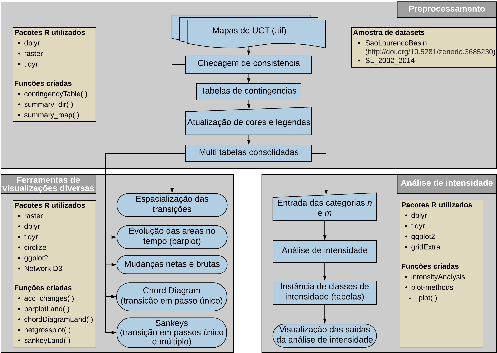

<!-- README.md is generated from README.Rmd. Please edit that file -->


```{r setup, include=FALSE}
knitr::opts_chunk$set(echo = TRUE)
```

# 

## O pacote R OpenLand

OpenLand é um pacote R de código aberto para a análise de séries temporais de uso e cobertura da terra (UCT). Ele inclui suporte para verificação de consistência e carregamento de dados raster espaço-temporais e plotagem espacial sintetizada. Várias métricas de alteração de UCT em intervalos de tempo regulares ou irregulares podem ser extraídas e visualizadas por meio de diagramas de trasição de passo único ou multipasso via Sankey e Chord Diagram. Uma análise de intensidade completa de acordo com Aldwaik e Pontius (2012) é implementada, incluindo ferramentas para a geração de gráficos de saída multinível padronizados.

## Estrutura conceitual de OpenLand

A estrutura de OpenLand é dividida em 3 (três) blocos de funcionalidades, que são i) o pré-processamento; ii) ferramentas de visualizações diversas e iii) a Análise de intensidade. A Figura 1 apresenta as diferentes partes do OpenLand com as suas funções, dependências e processos.

```{r, out.width='100%', fig.align='center', fig.cap='Figura 1 - Visão geral conceitual de OpenLand', echo=FALSE}

```

## Instalação

Para a instalação do pacote via o repositorio CRAN:

```{r installation1, eval = FALSE}
install.packages("OpenLand")
```

Também esta disponivel a versão em desenvolvimento no GitHub:

```{r installation2, eval = FALSE}
install.packages("devtools")
devtools::install_github("reginalexavier/OpenLand")
```

O material contendo a documentação de todas as funções de OpenLand é acessivel via a [página CRAN](https://cran.r-project.org/web/packages/OpenLand/index.html) do OpenLand ou via o [vignette](https://reginalexavier.github.io/OpenLand/articles/openland_vignette.html) de OpenLand que contem, inclusive, uma introdução sobre as funcionalidades do pacote.

## Este material
Este material visa ajudar o usuário na estrutura da análise que propõe o pacote. A funcionalidade de OpenLand é demonstrada usando um conjunto de dados de UCT (2002 – 2014) da bacia do rio São Lourenço (MT), que é uma das principais área de contribuição do Pantanal setentrional. Os dados usados são provenientes da 4ª edição do [Monitoramento de Mudanças na Cobertura e Uso da Terra na Bacia do Alto Paraguai - porção brasileira - Período de Revisão: 2012 a 2014](https://www.embrapa.br/pantanal/bacia-do-alto-paraguai) (EMBRAPA PANTANAL; INSTITUTO SOS PANTANAL; WWF-BRASIL, 2015) e a série temporal é composta por cinco rasters de UCT: 2002, 2008, 2010, 2012 e 2014.

##### Modo de usar o tutorial:
É preciso baixar este projeto diretamente [nesta página no GitHub](https://github.com/reginalexavier/Tutorial_OpenLand);  abrir o arquivo `Tutorial_Openland.Rproj` de preferencia com o RStudio. Com o projeto aberto no RStudio, dentro da pasta principal do projeto tem uma subpasta nomeada `Estudo_de_caso` que contem os scripts da análise do tutorial (`Openland_tutorial.Rmd`) e os 5 arquivos raster `(`r list.files("Estudo_de_caso/raw_tif")`)` da bacia do Rio São Lourenço na subpasta `raw_tif`.

#### [>>>> Slides de apresentação](https://reginalexavier.github.io/Tutorial_OpenLand/slides/OpenLand_slide) 


#### Referências

ALDWAIK, S. Z.; PONTIUS, R. G. Intensity analysis to unify measurements of size and stationarity of land changes by interval, category, and transition. Landscape and Urban Planning, v. 106, n. 1, p. 103–114, 2012. https://doi.org/10.1016/j.landurbplan.2012.02.010.

EMBRAPA PANTANAL; INSTITUTO SOS PANTANAL; WWF-BRASIL. Mapeamento da Bacia do Alto Paraguai. Disponível em: https://www.embrapa.br/pantanal/bacia-do-alto-paraguai. Acesso em: 22 ago. 2020.

EMBRAPA PANTANAL; INSTITUTO SOS PANTANAL; WWF-BRASIL. 2015. Monitoramento das alterações da cobertura vegetal e uso do Solo na Bacia do Alto Paraguai – Porção Brasileira – Período de Análise: 2012 a 2014. 4th ed. Brasilia. https://www.embrapa.br/documents/1354999/1529097/BAP+-+Mapeamento+da+Bacia+do+Alto+Paraguai+-+estudo+completo/e66e3afb-2334-4511-96a0-af5642a56283.

EXAVIER, R.; ZEILHOFER, P. OpenLand: Quantitative Analysis and Visualization of LUCC, 2020. https://cran.r-project.org/package=OpenLand.


