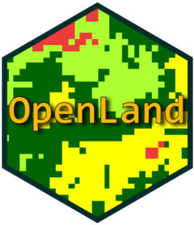

<!-- README.md is generated from README.Rmd. Please edit that file -->


```{r setup, include=FALSE}
knitr::opts_chunk$set(echo = TRUE)
```

# 

## O pacote R OpenLand

OpenLand é um pacote R de código aberto para a análise de séries temporais de uso e cobertura da terra (UCT). Ele inclui suporte para verificação de consistência e carregamento de dados raster espaço-temporais e plotagem espacial sintetizada. Várias métricas de alteração de UCT em intervalos de tempo regulares ou irregulares podem ser extraídas e visualizadas por meio de diagramas de trasição de passo único ou multipasso via Sankey e Chord Diagram. Uma análise de intensidade completa de acordo com Aldwaik e Pontius (2012) é implementada, incluindo ferramentas para a geração de gráficos de saída multinível padronizados.

## Estrutura conceitual de OpenLand

A estrutura de OpenLand é dividida em 3 (três) blocos de funcionalidades, que são i) o pré-processamento; ii) ferramentas de visualizações diversas e iii) a Análise de intensidade. A Figura 1 apresenta as diferentes partes do OpenLand com as suas funções, dependências e processos.

```{r, out.width='100%', fig.align='center', fig.cap='Figura 1 - Visão geral conceitual de OpenLand', echo=FALSE}
knitr::include_graphics('README_files/images/ADI.jpg')
```
### Pré-processamento

Este grupo de funcionalidades é constituído por funções criadas para receber os dados principais de entrada (séries temporais de mapas de UCT em formato matricial) para uma checagem inicial de consistências e/ou transforma-los e guardalos em formatos aproveitáveis pelas etapas posteriores.

As funções criadas para este grupo de funcionalidades são i) [`summary_dir()`](https://reginalexavier.github.io/OpenLand/reference/summary_dir.html), ii) [`summary_map()`](https://reginalexavier.github.io/OpenLand/reference/summary_map.html), e iii) [`contingencyTable()`](https://reginalexavier.github.io/OpenLand/reference/contingencyTable.html). A primeira função faz uma varredura de uma pasta indicada pelo usuário que contenha objetos raster e informa como saída, características dos mesmos numa tabela. A segunda apresenta informação de um único raster com valor categórico informando a proporção de cada categoria presente numa tabela. Essas duas funções constituem uma forma de obter informação rápida sobre os dados de entrada, desde antes mesmo de continuar com a extração dos dados para as análises. A terceira função (iii) calcula uma tabela de contingência para cada dois rasters consecutivos (iterativamente) no sentido crescente dos anos (etapa múltipla), isto é, nos intervalos [𝑌𝑡, 𝑌𝑡+1] e adicionalmente para o primeiro e o ultimo raster (uma etapa) [𝑌𝑡=1, 𝑌𝑇].

### Ferramentas de visualizações


### Analise de Intensidade
